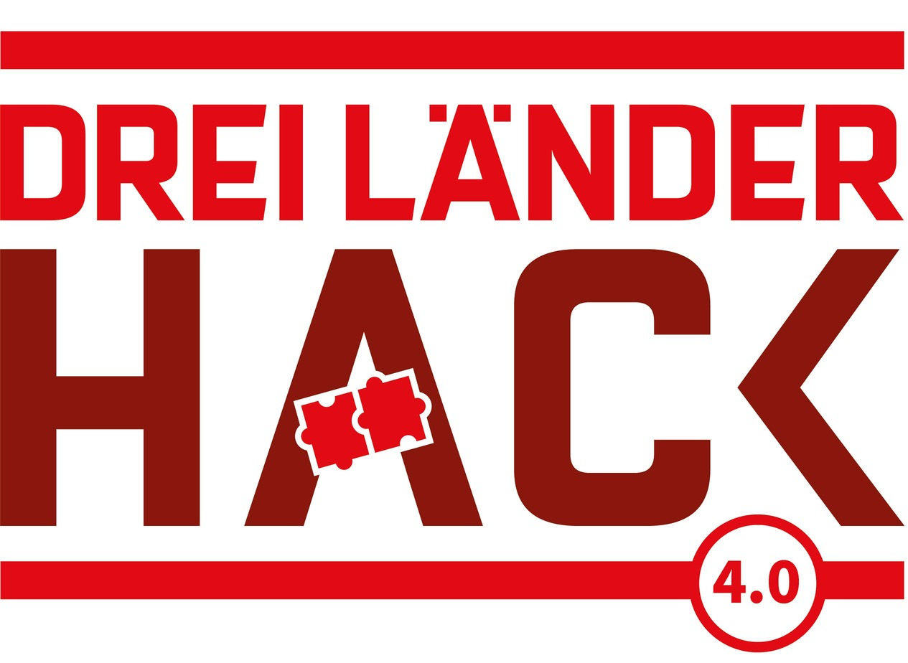

# Fix Our Rail - Find them all!

We identify typical errors with railway data in OpenStreetMap. OSM data is very
high quality already and is used in professional applications, e.g.,
[OSRD](https://osrd.fr/en/).

During the hackathon, we found algorithms to spot

* disconnected tracks
* suspicious switches
* stations apart from tracks (e.g., missing relation)
* weird track angles
* missing gauge information

Also see [the presentation we gave](Presentation.pdf).

## Background

  

This project has been initiated during the [Dreiländerhack 2023](https://bcc.oebb.at/de/das-leisten-wir/innovationen/dreilaenderhack), a joint hackathon organised by the railway companies ÖBB, DB, and SBB.

## Install

We have tried to set up a productive [Osmose](https://osmose.openstreetmap.fr/)
instance but ran into issues. Therefore, we used a local dev instance and put
the issues via XML via the API into a front end.

The hacky scripts to create these reports are in this repositories and will be
further developed.

# See also

* https://github.com/OpenRailFoundation/FixOurRail-weird-angles
* https://github.com/OpenRailFoundation/FixOurRail-osmose-frontend

## License

<!-- If you decide for another license, please change it here, and exchange the LICENSE file -->

The content of this repository is licensed under the [Apache 2.0 license](LICENSE).
